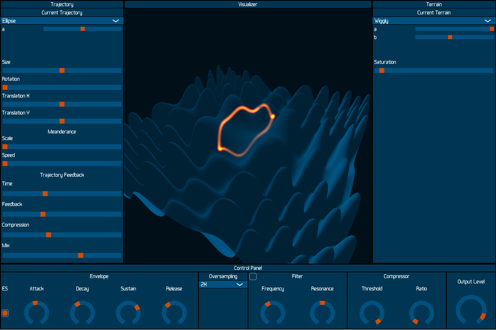
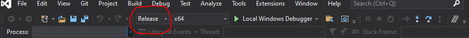
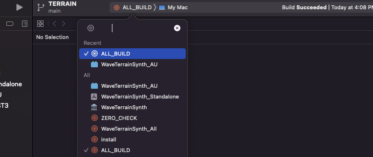
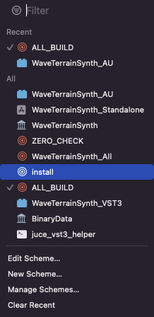
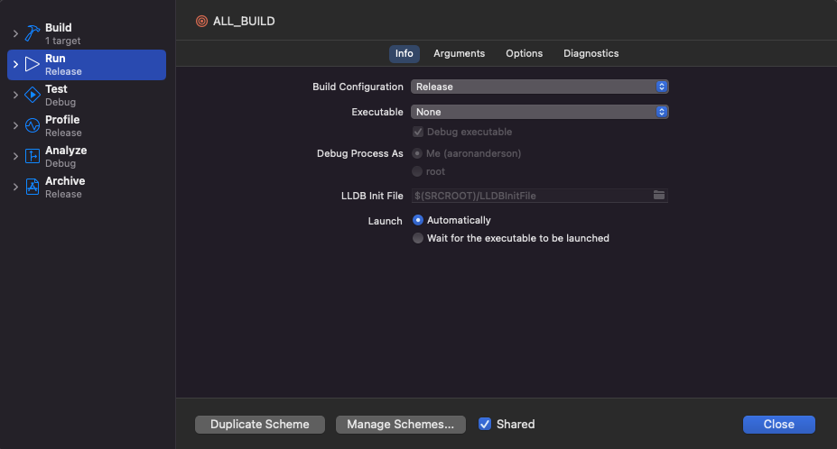

# Terrain

https://www.youtube.com/watch?v=xtvo_RxdEsY

Installer links are in the description of the youtube video linked above.

## Description
Terrain is a Wave Terrain Synthesis instrument plugin I've made available for free on Mac, Windows, and Linux systems.

In wave terrain synthesis, a sound is produced via a 2D trajectory scanning over a 3D surface, or terrain. The timbre produced is dependent on the shape and parameters of the trajectory, as well as the shape of the scanned terrain.

In Terrain, both the trajectory and terrain parameters may me modified at audio rate. To achieve this level of modification, both the trajectory and terrain are calculated per sample. This comes at the cost of computation time; Terrain is a computationally expensive synthesizer. 

In a simple case, an elliptical orbit scans a sinusoidal terrain. Introducing higher frequency sinusoids into the terrain introduces more harmonics into the resulting signal. The same goal may be accomplished by increasing the size of the trajectory.

If I adjust the modifier parameter on the trajectory, the ellipse will become narrow. In this narrow state,  changes in phase and the balance of harmonics may be heard as the trajectory is rotated. This becomes more obvious on more complex terrains.

Translation of the trajectory also has a substantial impact on the resulting signal. The peaks and troughs traversed by the trajectory determine the output; translation adjust which peaks and troughs are traversed, and when this traversal happens relative to the trajectory's phase. 

A trajectory that remains in the same location, and is otherwise unmodified, will create a static timbre. However, moving this otherwise static trajectory will create time-varying timbre. To this affect, I've added a modifier I've named Meanderance. This allows trajectories to displace about the terrain on their own accord. Both the speed and the scale of this meanderance can be controlled and automated.

A novel feature of terrain is the recursive trajectory feedback loop. In a similar manner to an audio feedback loop, the trajectory position feeds back onto itself over a determined amount of time. This effect will drastically modify the shape of a given trajectory. The problem of feedback explosion is even more pronounced with a two-dimensional signal. To remedy this, I developed a spatial compressor that keeps the signal within the bounds of a determined radius. 

All trajectories delivered with Terrain are periodic. In other words, the shape of the trajectory repeats itself at a given frequency. This is musically useful as the fundamental frequency may be determined and mapped to a keyboard or piano roll. While there are many trajectories to choose, I'll leave exploring them as an exercise to the user.

A terrain may be chosen from the given list; each with their own parameters. I will once again leave exploring this list as an exercise to the user. In addition to the specialized terrain parameters, each terrain may be freely saturated. The effect of this is very similar to traditional wave shaping.

The envelope generator mimics an analog style. The ES toggle determines whether or not the envelope will effect the size of the trajectory. This allows the brightness of the output signal to follow the loudness; a characteristic found in many acoustic instruments. 

Given the flexibility of trajectory behavior and terrain shape, alias frequencies are nearly impossible to predict and therefore cannot be prevented at the source. Anti-aliasing in Terrain is thus handled by oversampling. Be wary of using high oversampling factors for live performance as this method of alias reduction comes at a great computational cost.

# Building

The following sections are instructions to build Terrain from source on various platforms. These instructions assume that a machine is not prepared for software development, and that the user knows little about compiling code from source. If you are familiar with CMake build systems, you may safely ignore the following and build with tools that you are already comfortable with.

## Windows

Download and install CMake: https://cmake.org/download/

Download and install Git: https://git-scm.com/download/win 

Download and install Visual Studio Community: https://visualstudio.microsoft.com/vs/community/v

After these tools are installed on your system, open Git Bash.

Enter the following to obtain the source code. You may clone the repository in any directory; the following commands will clone the repository to your Documents folder.

`cd Documents`

`git clone https://github.com/aaronaanderson/Terrain`

`cd Terrain`

`git submodule update --init --recursive`

You should now have a folder named Terrain in your documents folder. Continue in Git Bash:

`mkdir build`

`cmake -B ./build -S .`

This command will generate a Visual Studio project ready to compile the source material. Use the file explorer to navigate to Documents/Terrain/build, and double-click TERRAIN.sln. This will open your installed version of visual studio.

At the top of the Visual Studio interface, make sure that the build type is set to Release.

Use the keyboard to enter ctl+shift+b to build the plugin.

You now have the compiled plugins, but these binaries must be moved to the appropriate file location of a DAW to find them. 

Navigate to Documents/Terrain/build/WaveTerrainSynth_artefacts/Release/VST3 and copy Terrain.vst3.

Paste this plugin into directory C:\Program Files\Common Files\VST3\

The VST3 plugin should now appear as an option the next time you start your preferred Digital Audio Workstation.

## Mac

Download and install XCode: https://developer.apple.com/xcode/
Download and install CMake: https://cmake.org/download/

Open the Terminal application and enter the following commands. You may clone the repository in any directory; the following commands will clone the repository to your Documents folder.

`cd Documents`

`git clone https://github.com/aaronaanderson/Terrain`

`cd Terrain`

`git submodule update --init --recursive`

You should now have a folder named Terrain in your documents folder. Continue in Git Bash:

`mkdir build`

`cmake -B ./build -S . -G Xcode`

Use Finder to navigate to Documents/Terrain/build/ and double-click on TERRAIN.xcodeproj.

With XCode open, select the AllBuild option:

In the same drop-down menu, select Edit Scheme:

In the following pop-up menu, select Realease for the build configuration:

Use the keyboard to enter cmd+b to build the plugin.

To install the the Audio Unit build, navigate to Documents/Terrain/build/WaveTerrainSynth_artefacts/Release/AU and copy Terrain.component. Paste this binary in file location /Library/Audio/Plug-Ins/Components/.

To install the VST3 build, navigate to Documents/Terrain/build/WaveTerrainSynth_artefacts/Release/VST3 and copy Terrain.vst3. Paste this binary in file location Library/Audio/Plug-ins/VST3/

## Linux

Open Terminal and install Git with the following command:

`apt-get install git`

Install GCC compilers, make, and the opengl Dev libraries:

`sudo apt-get install build-essential libgl1-mesa-dev`

Install CMake: https://cmake.org/download/

Use the terminal to clone the repository. The following commands will clone this repository to your Documents folder.

`cd Documents`

`git clone https://github.com/aaronaanderson/Terrain`

`cd Terrain`

`git submodule update --init --recursive`

Use CMake to make the build files.

`mkdir build`

`cmake -B ./build -S . -DCMAKE_BUILD_TYPE=Release`

`cd build`

`make -j4`

To install the plugin binary, use the file explorer to navigate to Documents/Terrain/build/WaveTerrainSynth_artefacts/Release/VST3/ and copy Terrain.vst3. Paste this file in location /lib/vst3/. Note that copying files to this location may require elevated privileges

# Gratitude 

Thank you to my professors John Thompson and Karl Yerkes for their endless patience and dedication while passing me a portion of their vast knowledge. 
Thank you to Rodney DuPlessis for helping me with the Linux build and for being an all-around good friend.
Thank you to Jacky Ligon for testing the MTS-ESP build and encouraging me with their great music: jackyligon.com
